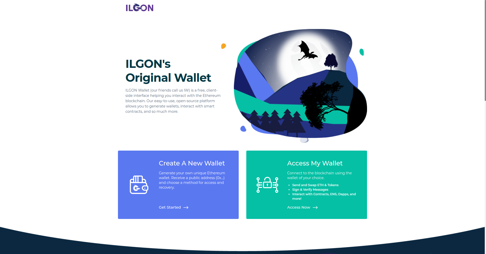

ILGON Wallet is a fork of MyEtherWallet. ILGON Wallet is a doorway to the Ilgon blockchain that is a fork of MyEtherWallet, allowing users to manage their own funds without a centralized platform.

## Philosophy

* **Empower the people**: Give people the ability to interact with the Ilgon blockchain easily, without having to run a full node.
* **Make it easy & free**: Everyone should be able to create a wallet and send Ilgon & Tokens without additional cost.
* **People are the Priority**: People are the most important & their experience trumps all else. If monetization worsens the experience, we don't do it. (e.g. ads)
* **A learning experience, too**: We want to educate about Ilgon, security, privacy, the importance of controlling your own keys, how the blockchain works, and how Ilgon and blockchain technologies enable a better world.
* **If it can be hacked, it will be hacked**: Never save, store, or transmit secret info, like passwords or keys.
* **Offline / Client-Side**: User should be able to run locally and offline without issue.
* **Private**: No tracking!!! No emails. No ads. No demographics. We don't even know how many wallets have been generated, let alone who / what / where you are.
* **Open source & auditable**

## Bug / Feature Request

If you find a bug, or want a new feature added, please submit it on the [Github Issues](https://github.com/ilgon-technologies/ilgon-wallet/issues)

## Developers

### Starting the wallet locally

1. Make sure you have NodeJS >= 10, but < 12
2. Run `npm i`
3. Set the `VUE_APP_MODE` env variable to `prod` or `test` (this influences the selectable networks)
4. Run `npm run start:ci`

### Building

1. Make sure you have NodeJS >= 10, but < 12
2. Run `npm i`
3. Set the `VUE_APP_MODE` env variable to `prod` or `test` (this influences the selectable networks)
4. Run `./build.sh`

### Deploying to live server

1. `git clone https://github.com/ilgon-technologies/ilgon-wallet-page deployment`
2. Build
3. Run `./update_deployment.sh`
4. Commit and push the repo in the deployment folder

### Location of RPC urls

The `./src/network/nodes` folder contains all nodes seperated in files. In each file the RPC url is the value of the `url` key.

### Location of Staking contract address and ABI

In `./src/network/types` folder `contracts.js` constains the staking contract of the production network, and `contracts-test.js` contains the contract of the test network.

### Modifying ERC20 tokens

#### For ILG

1. Add the logo to `builds/web/public/img/icons/tokens`. The name should be `${TOKEN_SYMBOL}.png`
2. In `src/networks/types` for live add token to `tokens-ilg.json`, for test add to `tokens-ilgt.json`
